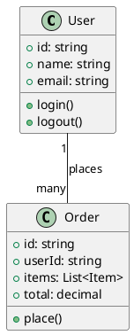
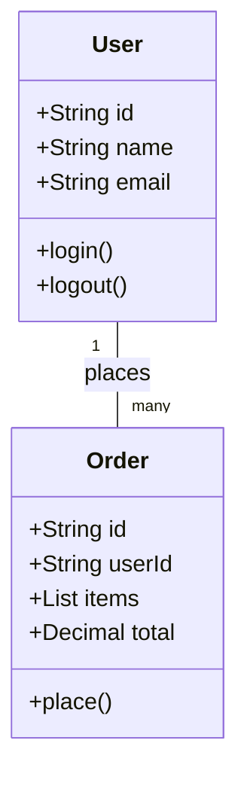
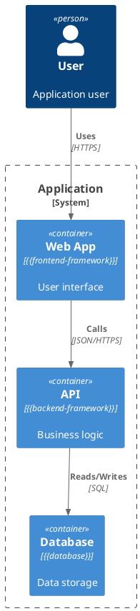

# Diagram Standards

> **Applies to:** ALL profiles  
> **Purpose:** Define diagram conventions, formats, and quality standards

---

## Supported Formats

### Primary: PlantUML

**Default format for all diagrams.** PlantUML is text-based, version-controllable, and renders to images.

**File extension:** `.puml`

**When to use:** Always, unless developer overrides.

**Example:**


### Secondary: Mermaid

**Use when:** Markdown-native rendering is preferred (GitHub, GitLab, Notion).

**File extension:** `.mmd` or inline in markdown

**When to use:** Developer prefers markdown-native diagrams, or platform supports Mermaid rendering.

**Example:**


### Alternative: D2

**Use when:** Modern, clean syntax is preferred. Good for architecture diagrams.

**File extension:** `.d2`

**When to use:** Developer explicitly requests D2, or for high-level architecture diagrams.

**Example:**
```d2
direction: right

User: {
  shape: person
}

Order: {
  shape: rectangle
  style.fill: "#f0f0f0"
}

User -> Order: places
```

### Architecture: C4-PlantUML

**Use when:** System-level architecture diagrams (context, container, component diagrams).

**File extension:** `.puml` (with C4 includes)

**When to use:** System overview, onboarding docs, architecture decision records.

**Example:**


---

## Diagram Types

### Class Diagram

**Required for:** Every task design

**Shows:**
- Classes/interfaces and their attributes/methods
- Inheritance relationships
- Association/composition/aggregation
- Multiplicity

**Naming:** `NN-class-diagram.puml` where NN is sequence number (01, 02, ...)

**Location:** `flow-storage/tasks/{task-name}/design/diagrams/`

### Package/Module Diagram

**Required for:** Every task design

**Shows:**
- Modules/packages/namespaces
- Dependencies between modules
- Layer boundaries (presentation, domain, infrastructure)

**Naming:** `NN-package-diagram.puml`

**Location:** `flow-storage/tasks/{task-name}/design/diagrams/`

### Sequence Diagram

**Required for:** Tasks with non-trivial flows (3+ interactions)

**Shows:**
- Objects/lifelines
- Message sequence
- Activation bars
- Return values

**Naming:** `NN-sequence-{flow-name}.puml`

**Location:** `flow-storage/tasks/{task-name}/design/diagrams/`

### State Diagram

**Required for:** Tasks with state machines (optional otherwise)

**Shows:**
- States
- Transitions
- Events triggering transitions
- Entry/exit actions

**Naming:** `NN-state-{entity-name}.puml`

**Location:** `flow-storage/tasks/{task-name}/design/diagrams/`

### Entity-Relationship Diagram

**Required for:** Tasks involving data models (optional otherwise)

**Shows:**
- Entities
- Attributes
- Relationships
- Cardinality

**Naming:** `NN-erd.puml`

**Location:** `flow-storage/tasks/{task-name}/design/diagrams/`

### Task Flow Dependency Diagram

**Required for:** Every task (generated in design-flow Phase 2 sub-task 2.1 PLAN)

**Shows:**
- Task flows as nodes
- Dependencies as edges
- Critical path

**Naming:** `NN-task-flow-dependencies.puml`

**Location:** `flow-storage/tasks/{task-name}/design/diagrams/`

---

## Visual-First Design Mode

In design-flow Phase 1 sub-task 1.2 (DESIGN), diagrams come BEFORE text.

### Process

1. **Developer describes task** in 1-2 sentences
2. **AI generates rough class diagram** (PlantUML)
3. **Present to developer:** "Does this match your intent?"
4. **Iterate:**
   - Developer: "Add X class", "Remove Y relationship"
   - AI updates diagram
   - Re-present
5. **Approval:** Developer accepts diagram
6. **Generate text:** AI creates task-design.md, task-technical-design.md from approved diagram

### Why Visual-First?

- Humans process diagrams faster than text
- Misunderstandings surface earlier
- Class relationships are explicit, not implied
- Package boundaries are visible
- Sequence flows are traceable

### Diagram Iteration Protocol

```
AI: Generated class diagram v1:
     [diagram rendered]

     Review and choose:
     [A]ccept — Looks correct, generate text docs
     [M]odify — Provide feedback, I'll update
     [R]estart — Start over with different approach

Developer: M

Developer: Add InventoryManager class between Order and Stock

AI: Updated diagram v2:
     [updated diagram rendered]
     
     Changes:
     + Added InventoryManager class
     + Connected Order -> InventoryManager -> Stock
     
     [A]ccept / [M]odify / [R]estart:

Developer: A

AI: Generating task-design.md and task-technical-design.md from approved diagram...
```

---

## Quality Standards

### Completeness

- [ ] All classes from design are in diagram
- [ ] All relationships are shown (inheritance, association, composition)
- [ ] Multiplicity is specified where meaningful
- [ ] Methods/attributes relevant to task are included

### Clarity

- [ ] Diagram fits on one screen (or is split logically)
- [ ] Labels are readable
- [ ] Colors are used consistently (if supported)
- [ ] No overlapping elements

### Accuracy

- [ ] Class names match codebase
- [ ] Inheritance matches actual code
- [ ] Associations match actual dependencies
- [ ] Sequence matches actual flow

---

## Rendering

**Diagrams MUST be rendered to images.** A `.puml` (or `.d2`) source file alone is not a deliverable — without a matching rendered image (`.svg` preferred, `.png` fallback) committed alongside, anyone reading the docs has to run a renderer locally to see the diagram. That defeats the purpose of having diagrams in version control.

### Render policy

- **Default output format:** `.svg` (text-based, version-controllable, scales without quality loss, diff-readable)
- **Fallback:** `.png` if SVG rendering fails or is unsupported by the toolchain
- **Both source and image are committed.** `.puml` next to `.svg` (or `.png`) in the same `diagrams/` directory.
- **Mermaid is the exception** — when Mermaid is the chosen format AND the docs are read on a platform that renders Mermaid natively (GitHub, GitLab, Notion), no rendered image is needed because the platform handles it. Outside those platforms, render to SVG/PNG anyway.

### Flow responsibility

A flow that produces diagrams (design-flow Phase 1 sub-task 1.2, implement-flow Phase 1 sub-task 1.5 DOC-SYNC, pr-flow capture mode Phase 1) is **not done with that phase until rendering succeeds**. If the local toolchain doesn't have the renderer:

1. Stop the phase. Do not present an [A]ccept gate with unrendered diagrams.
2. Tell the developer exactly what to install for their platform (commands below).
3. After install, re-run rendering and proceed.

Silently producing only `.puml` files is a Rule 4 violation ("diagrams are mandatory") because an unrendered diagram is, in practice, no diagram.

### Local Rendering

**PlantUML** (preferred — most expressive, widely supported):

```bash
# Native package (Manjaro/Arch)
sudo pacman -S plantuml
plantuml -tsvg flow-storage/tasks/{task-name}/design/diagrams/*.puml

# Native package (Debian/Ubuntu)
sudo apt install plantuml
plantuml -tsvg flow-storage/tasks/{task-name}/design/diagrams/*.puml

# Native package (macOS)
brew install plantuml
plantuml -tsvg flow-storage/tasks/{task-name}/design/diagrams/*.puml

# Java + jar (no package install needed; needs Java)
curl -L -o /tmp/plantuml.jar https://github.com/plantuml/plantuml/releases/latest/download/plantuml.jar
java -jar /tmp/plantuml.jar -tsvg flow-storage/tasks/{task-name}/design/diagrams/*.puml

# Docker (zero local install)
docker run --rm -v "$PWD:/data" plantuml/plantuml -tsvg flow-storage/tasks/{task-name}/design/diagrams/*.puml
```

**D2:**
```bash
# Install: https://d2lang.com/tour/install
d2 diagrams/feature.d2 diagrams/feature.svg
```

**Mermaid (when not on a Mermaid-rendering platform):**
```bash
# Install: npm i -g @mermaid-js/mermaid-cli
mmdc -i diagram.mmd -o diagram.svg
```

### Verification

After rendering, every `.puml` (or `.d2` / `.mmd`) must have a matching image in the same directory:

```bash
# Quick check — any .puml without a .svg/.png sibling?
for f in flow-storage/tasks/*/diagrams/*.puml; do
  base="${f%.puml}"
  if [ ! -f "${base}.svg" ] && [ ! -f "${base}.png" ]; then
    echo "MISSING IMAGE: $f"
  fi
done
```

### CI/CD Integration

Re-render on push to keep images in sync with sources:

```yaml
# GitHub Actions
- name: Render diagrams
  run: |
    sudo apt-get install -y plantuml
    plantuml -tsvg flow-storage/tasks/*/diagrams/*.puml
    # Either commit back via auto-commit action, or fail the build if
    # any .svg is missing (forces local render before push).
```

---

## Format Selection

**Default:** PlantUML

**Developer override:** Create `.ai-workflow/config.md` with diagram format preference:
```markdown
## Diagram Format

Preferred format: Mermaid
Fallback format: PlantUML
```

**AI decision tree:**
1. Check `.ai-workflow/config.md` for format preference (file is optional — skip if absent)
2. If not specified, use PlantUML
3. If platform supports Mermaid natively (GitHub/GitLab), suggest Mermaid
4. If developer explicitly requests D2, use D2

---

## Diagram Maintenance

Diagrams are living documents:
- Updated when code changes
- Updated when architecture evolves
- Version-controlled alongside code
- Reviewed in PRs

**Update triggers:**
- Design flow — Creates initial diagrams
- Implement flow — May update sequence diagrams
- PR flow, `capture` mode — Updates diagrams with post-merge knowledge
- Manual edits by developers
