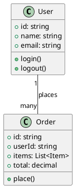
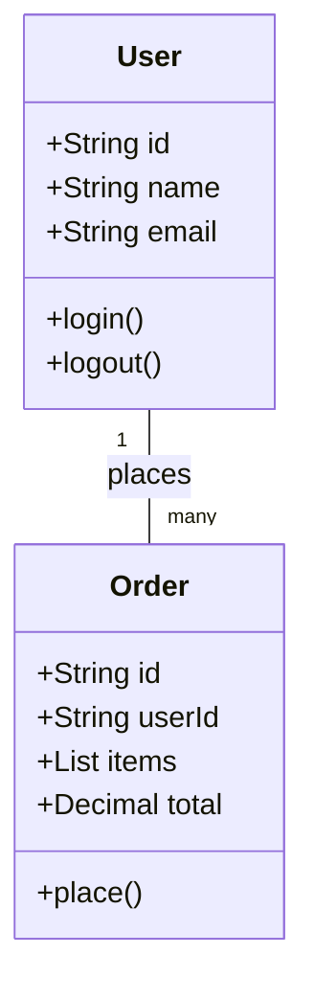
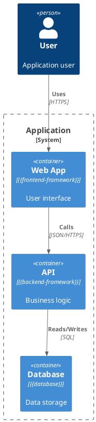

# Diagram Standards

> **Applies to:** ALL profiles  
> **Purpose:** Define diagram conventions, formats, and quality standards

---

## Supported Formats

### Primary: PlantUML

**Default format for all diagrams.** PlantUML is text-based, version-controllable, and renders to images.

**File extension:** `.puml`

**When to use:** Always, unless developer overrides.

**Example:**


### Secondary: Mermaid

**Use when:** Markdown-native rendering is preferred (GitHub, GitLab, Notion).

**File extension:** `.mmd` or inline in markdown

**When to use:** Developer prefers markdown-native diagrams, or platform supports Mermaid rendering.

**Example:**


### Alternative: D2

**Use when:** Modern, clean syntax is preferred. Good for architecture diagrams.

**File extension:** `.d2`

**When to use:** Developer explicitly requests D2, or for high-level architecture diagrams.

**Example:**
```d2
direction: right

User: {
  shape: person
}

Order: {
  shape: rectangle
  style.fill: "#f0f0f0"
}

User -> Order: places
```

### Architecture: C4-PlantUML

**Use when:** System-level architecture diagrams (context, container, component diagrams).

**File extension:** `.puml` (with C4 includes)

**When to use:** System overview, onboarding docs, architecture decision records.

**Example:**


---

## Diagram Types

### Class Diagram

**Required for:** Every feature design

**Shows:**
- Classes/interfaces and their attributes/methods
- Inheritance relationships
- Association/composition/aggregation
- Multiplicity

**Naming:** `NN-class-diagram.puml` where NN is sequence number (01, 02, ...)

**Location:** `docs/features/{name}/diagrams/`

### Package/Module Diagram

**Required for:** Every feature design

**Shows:**
- Modules/packages/namespaces
- Dependencies between modules
- Layer boundaries (presentation, domain, infrastructure)

**Naming:** `NN-package-diagram.puml`

**Location:** `docs/features/{name}/diagrams/`

### Sequence Diagram

**Required for:** Features with non-trivial flows (3+ interactions)

**Shows:**
- Objects/lifelines
- Message sequence
- Activation bars
- Return values

**Naming:** `NN-sequence-{flow-name}.puml`

**Location:** `docs/features/{name}/diagrams/`

### State Diagram

**Required for:** Features with state machines (optional otherwise)

**Shows:**
- States
- Transitions
- Events triggering transitions
- Entry/exit actions

**Naming:** `NN-state-{entity-name}.puml`

**Location:** `docs/features/{name}/diagrams/`

### Entity-Relationship Diagram

**Required for:** Features involving data models (optional otherwise)

**Shows:**
- Entities
- Attributes
- Relationships
- Cardinality

**Naming:** `NN-erd.puml`

**Location:** `docs/features/{name}/diagrams/`

### Issue Dependency Diagram

**Required for:** Every feature (generated in Phase 5)

**Shows:**
- Issues as nodes
- Dependencies as edges
- Critical path

**Naming:** `NN-issue-dependencies.puml`

**Location:** `docs/features/{name}/diagrams/`

---

## Visual-First Design Mode

In design-wizard Phase 2, diagrams come BEFORE text.

### Process

1. **Developer describes feature** in 1-2 sentences
2. **AI generates rough class diagram** (PlantUML)
3. **Present to developer:** "Does this match your intent?"
4. **Iterate:**
   - Developer: "Add X class", "Remove Y relationship"
   - AI updates diagram
   - Re-present
5. **Approval:** Developer accepts diagram
6. **Generate text:** AI creates DESIGN.md, TDD.md from approved diagram

### Why Visual-First?

- Humans process diagrams faster than text
- Misunderstandings surface earlier
- Class relationships are explicit, not implied
- Package boundaries are visible
- Sequence flows are traceable

### Diagram Iteration Protocol

```
AI: Generated class diagram v1:
     [diagram rendered]

     Review and choose:
     [A]ccept — Looks correct, generate text docs
     [M]odify — Provide feedback, I'll update
     [R]estart — Start over with different approach

Developer: M

Developer: Add InventoryManager class between Order and Stock

AI: Updated diagram v2:
     [updated diagram rendered]
     
     Changes:
     + Added InventoryManager class
     + Connected Order -> InventoryManager -> Stock
     
     [A]ccept / [M]odify / [R]estart:

Developer: A

AI: Generating DESIGN.md and TDD.md from approved diagram...
```

---

## Quality Standards

### Completeness

- [ ] All classes from design are in diagram
- [ ] All relationships are shown (inheritance, association, composition)
- [ ] Multiplicity is specified where meaningful
- [ ] Methods/attributes relevant to feature are included

### Clarity

- [ ] Diagram fits on one screen (or is split logically)
- [ ] Labels are readable
- [ ] Colors are used consistently (if supported)
- [ ] No overlapping elements

### Accuracy

- [ ] Class names match codebase
- [ ] Inheritance matches actual code
- [ ] Associations match actual dependencies
- [ ] Sequence matches actual flow

---

## Rendering

### Local Rendering

**PlantUML:** Requires Java + PlantUML.jar or server
```bash
# Using PlantUML server
plantuml -tsvg diagrams/*.puml

# Using Docker
docker run -v $(pwd):/data plantuml/plantuml diagrams/*.puml
```

**Mermaid:** Rendered natively by GitHub/GitLab/Notion

**D2:**
```bash
d2 diagrams/*.d2 diagrams/
```

### CI/CD Integration

Generate diagrams in CI:
```yaml
# GitHub Actions example
- name: Generate Diagrams
  run: |
    plantuml -tsvg docs/features/*/diagrams/*.puml
    # Commit SVGs back to repo or upload as artifacts
```

---

## Format Selection

**Default:** PlantUML

**Developer override:** Add to `.ai-workflow/config.md`:
```markdown
## Diagram Format

Preferred format: Mermaid
Fallback format: PlantUML
```

**AI decision tree:**
1. Check `.ai-workflow/config.md` for format preference
2. If not specified, use PlantUML
3. If platform supports Mermaid natively (GitHub/GitLab), suggest Mermaid
4. If developer explicitly requests D2, use D2

---

## Diagram Maintenance

Diagrams are living documents:
- Updated when code changes
- Updated when architecture evolves
- Version-controlled alongside code
- Reviewed in PRs

**Update triggers:**
- `/design-wizard` — Creates initial diagrams
- `/implement-wizard` — May update sequence diagrams
- `/pr-wizard --mode=capture` — Updates diagrams with post-merge knowledge
- Manual edits by developers
